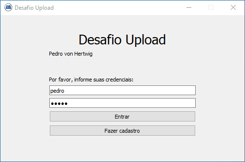

# Desafio Upload

Esse foi um desafio que fiz pro processo seletivo de uma empresa. Ele consiste em duas partes: um cliente em Qt (com 
foco em Windows) e um servidor back-end em tecnologia de minha escolha. O objetivo é que o cliente consiga fazer upload
de arquivos e o servidor os armazene em uma pasta específica. 

Pontos essenciais propostos:

* Login
  * Poderia ser com credenciais hard-coded, mas decidi implementar um sistema de cadastro e autenticação via JWT
* Upload de arquivo pra uma pasta junto à aplicação de servidor
* Botões de seleção de arquivo e upload
  * Implementei também uma área de "Arraste um arquivo aqui" para seleção mais fácil
* Barra de progresso
* Opção de cancelamento do upload
* Aplicativo sempre disponível no system tray até que fechado por lá (menu de clique direito)

Em nome da anonimidade removi todas as referências à empresa e troquei o ícone usado (: 

# Escolhas de tecnologias

## Servidor

#### FastAPI

O FastAPI é uma micro-framework parecida com Flask, mas vem com alguns brindes. Um deles é a validação automática 
de modelos de entrada e saída, usando o Pydantic. O Pydantic verifica que todos os campos obrigatórios estão presentes,
que os campos estão dentro das limitações impostas (por exemplo, de tamanho máximo de string pra dados textuais e entre 
um valor mínimo e máximo pra dados numéricos).

Outra vantagem legal é que ele automaticamente gera documentação online, com funcionalidade no estilo "postman" de
envio de requisições e com tipos e estruturas automaticamente anotadas com base nos modelos definidos por Pydantic.
Experimente acessar http://localhost:8000/docs ! 

#### Peewee

O Peewee é um ORM Python parecido com o SQLAlchemy, mas um pouco mais simples. Como a maioria dos ORMs, tem a vantagem 
de proporcionar uma interface comum pra vários sistemas de bancos de dados. Aqui foi usado o SQLite, mas poderíamos 
facilmente usar o PostgreSQL com poucas ou nenhuma modificação ao código.

#### Argon2

Já escrevi brevemente [no meu blog](https://pedrovhb.com/como-sites-com-login-nao-guardam-sua-senha-e-porque-nao-devem/)
 sobre como não é seguro armazenar senhas em texto simples. O Argon2 é um algoritmo de hash projetado especificamente 
pra senhas e que também automaticamente gera e armazena um salt, o tornando uma boa escolha pra isso.

#### JWT

JWT é um mecanismo stateless de autenticação que garante a integridade dos dados através de criptografia simétrica.
Os dados que o cliente carrega (por exemplo, um nome de usuário) podem ser decodados sem a chave privada, mas com 
a garantia de que o servidor os gerou e assinou.

#### PyTest

Usei o Pytest com o TestClient do FastAPI pra ter cobertura completa de testes do código do servidor. Pra evitar
usar o banco de dados principal nos testes, usei também o pytest-env, plugin que possibilita setar variáveis de ambiente
nos testes. Assim, o arquivo de banco de dados usado é isolado e não afeta a "produção".

## Cliente

#### PySide2 (Qt for Python)

O uso de Qt com Python foi um requisito do desafio, mas se tivesse que escolher hoje, usaria o PySide2. Não é 
particularmente bem documentado e nem pythônico (isso sendo decorrência da tradução relativamente direta da API original
em C++), mas em geral funciona bem. É multiplataforma, o Qt Designer facilita enormemente o trabalho de layout, os 
componentes têm aparência moderna e o Linguist transforma o trabalho massivo de localização em uma coisa simples e 
organizada. A licença LGPL também é atraente em comparação com o PyQt, que é GPL.

#### requests com requests-toolbelt

O `requests` é padrão de indústria por bons motivos; dificilmente se vê uma interface tão bem projetada. Esse projeto
em particular foi a primeira vez em que precisei de algumas coisas que o `requests` sozinho não conseguia me dar: 
update não-blocante de informações sobre o status do upload (quantos bytes já foram enviados/quantos faltam) e 
cancelamento de upload em progresso. Por sorte outras pessoas já precisaram disso e o `requests-toolbelt` implementa
facilidades pra isso. Ótimo projeto! 

# Configuração & execução

O `requirements.txt` pro cliente e servidor eram originalmente separados, mas como juntei o cliente e servidor num mesmo
repositório e como a aplicação é só pra fins de demonstração, uni os dois pra que um mesmo ambiente virtual pudesse 
executar tanto o cliente como o servidor; assim, o `venv` só tem que ser definido uma vez.

### Configuração do ambiente

Suponho aqui que `python` chama o Python 3.7+. Se necessário, substitua o comando `python` por `python3` ou 
`python3.7`. Suponho também que o terminal esteja aberto na raiz do projeto.

* Crie um ambiente virtual para instalação das bibliotecas necessárias:

`python -m venv venv`

* Ative o ambiente virtual:

  * Windows: `venv\Scripts\activate`
  * Linux/Unix: `source venv/bin/activate`

* Instale as bibliotecas requeridas:

`pip install -r requirements.txt`

### Execução do programa

* Executar testes do servidor:

`cd server && pytest test.py`

* Executar servidor:

`cd server && python main.py`

* Executar cliente (assegure-se antes de que o servidor esteja sendo executado):

`cd client && python main.py`